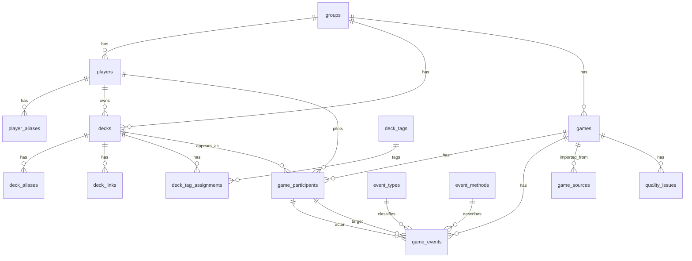

# Propuesta de base de datos para MTG Commander Stats

Este documento describe un esquema recomendado para una version con backend/app movil, basado en la app web estatica actual. Mantiene los conceptos existentes (`games.json`, `participants`, `events`, `deck_catalog.csv`) y agrega flexibilidad para crear jugadores, decks, metodos, eventos y metadata nueva sin cambiar el modelo cada vez.

Recomendacion principal para este proyecto: MySQL 8+ en el servidor personal. El modelo es relacional porque la app necesita relaciones, filtros, reportes, matchups y agregaciones. MySQL 8 soporta columnas `JSON`, indices suficientes para este volumen de datos y queries compatibles con una API movil. Si luego se usa otro backend, el concepto principal sigue siendo el mismo: `games` + `game_participants` + `game_events` + `decks`.

## Principios

1. Desconocido es `NULL`, no `false` ni `0`.
2. `false` significa que se registro explicitamente que algo no ocurrio.
3. Separar jugador, piloto y dueno de deck.
4. Separar perder de ser eliminado.
5. Guardar dato crudo y dato normalizado.
6. Permitir valores nuevos con `review_status = pending`.
7. Calcular estadisticas desde datos base; no guardar winrate como fuente de verdad.
8. Mantener exports compatibles con la web estatica actual.

## IDs

Usar UUID como primary key interno guardado en MySQL como `CHAR(36)` para simplicidad. Si algun dia se necesita optimizar almacenamiento, puede migrarse a `BINARY(16)`, pero `CHAR(36)` es mas facil para desarrollo y debugging.

```text
id: CHAR(36) con UUID interno
public_code: G2026-076
slug: chepe--jin-sakai
```


## Decisiones MySQL

Usar MySQL 8+ con InnoDB y `utf8mb4`.

| Concepto logico | Tipo MySQL recomendado | Nota |
|---|---|---|
| UUID | `CHAR(36)` | Simple de leer, copiar y depurar. |
| Texto corto | `VARCHAR(n)` | Para nombres, slugs, enums flexibles. |
| Texto largo | `TEXT` | Para notas y lineas originales. |
| JSON flexible | `JSON` | Para metadata, payloads y arrays pequenos. |
| Boolean | `TINYINT(1)` / `BOOLEAN` | En MySQL `BOOLEAN` es alias de `TINYINT(1)`. |
| Fecha | `DATE` | Para fecha de partida. |
| Hora local | `TIME` | Para hora escrita localmente. |
| Fecha/hora auditoria | `TIMESTAMP` | Guardar en UTC. |
| Decimal/cantidad | `DECIMAL(10,2)` | Para valores numericos de eventos si aplica. |
| Arrays simples | `JSON` | Ejemplo: `color_identity = ["W","U","B"]`. |

Evitar `ENUM` de MySQL al inicio. Es mejor usar `VARCHAR(30)` o `VARCHAR(50)` para estados/categorias y validar en backend. Asi se pueden agregar valores nuevos desde `Other` sin migraciones constantes.
## Valores recomendados para campos tipo VARCHAR

### `game_location`

```text
virtual
in_person
hybrid
unknown
```

### `game_result_type`

```text
win
draw
cancelled
unknown
```

### `participant_result`

```text
winner
non_winner
draw
unknown
```

`non_winner` significa que no gano, pero no implica eliminacion.

### `participant_end_status`

```text
alive_at_game_end
eliminated
conceded
self_eliminated
unknown
```

Ejemplo: si Chepe gana con Approach of the Second Sun y Jairo seguia vivo:

```json
{
  "participant_result": "non_winner",
  "end_status": "alive_at_game_end"
}
```

### `confidence_level`

```text
high
medium
low
unknown
```

### `review_status`

```text
approved
pending
needs_review
rejected
archived
```

### `event_explicitness`

```text
explicit
inferred
manual_correction
```

## Diagrama conceptual



## Tablas core

### `groups`

Sirve para soportar mas de un grupo, liga o pod en el futuro.

| Campo | Tipo | Null | Ejemplo | Descripcion |
|---|---|---|---|---|
| `id` | char(36) | no | `grp_main` | ID interno. |
| `name` | text | no | `MTG Commander Grupo` | Nombre visible. |
| `timezone` | text | no | `America/Guatemala` | Zona horaria por defecto. |
| `settings` | JSON | no | `{"virtual_clockwise_order":["Jairo","Andres","Cris","Chepe"]}` | Config flexible. |
| `created_at` | timestamp | no | `2026-08-03T20:00:00Z` | Creacion. |
| `updated_at` | timestamp | no | `2026-08-03T20:00:00Z` | Ultima actualizacion. |

```json
{
  "id": "grp_main",
  "name": "MTG Commander Grupo",
  "timezone": "America/Guatemala",
  "settings": {
    "virtual_clockwise_order": ["Jairo", "Andres", "Cris", "Chepe"],
    "default_location": "virtual"
  }
}
```

### `players`

Jugadores canonicos.

| Campo | Tipo | Null | Ejemplo | Descripcion |
|---|---|---|---|---|
| `id` | char(36) | no | `ply_andres` | ID interno. |
| `group_id` | char(36) | no | `grp_main` | Grupo. |
| `canonical_name` | text | no | `Andres` | Nombre canonico. |
| `display_name` | text | no | `Andres` | Nombre visible. |
| `normalized_name` | text | no | `andres` | Para matching. |
| `status` | text | no | `active` | `active`, `inactive`, `archived`. |
| `review_status` | text | no | `approved` | Estado de revision. |
| `notes` | text | si | `Tambien aparece como adnres` | Notas. |
| `created_at` | timestamp | no | `2026-08-03T20:00:00Z` | Creacion. |
| `updated_at` | timestamp | no | `2026-08-03T20:00:00Z` | Actualizacion. |

```json
{
  "id": "ply_paniagua",
  "group_id": "grp_main",
  "canonical_name": "Paniagua",
  "display_name": "Paniagua",
  "normalized_name": "paniagua",
  "status": "active",
  "review_status": "approved",
  "notes": "Antes aparecia como Pani o panigua."
}
```

### `player_aliases`

Aliases que resuelven a un jugador canonico.

| Campo | Tipo | Null | Ejemplo | Descripcion |
|---|---|---|---|---|
| `id` | char(36) | no | `pal_pani` | ID. |
| `player_id` | char(36) | no | `ply_paniagua` | Jugador canonico. |
| `alias` | text | no | `Pani` | Texto observado. |
| `normalized_alias` | text | no | `pani` | Alias normalizado. |
| `source` | text | si | `manual` | Origen. |
| `review_status` | text | no | `approved` | Revision. |

```json
{
  "id": "pal_pani",
  "player_id": "ply_paniagua",
  "alias": "Pani",
  "normalized_alias": "pani",
  "source": "manual",
  "review_status": "approved"
}
```

### `decks`

Identidad canonica del deck real. Si dos personas tienen decks distintos con el mismo nombre, son dos filas diferentes. Si un deck fue prestado, sigue siendo una sola fila y cambia solo el piloto en `game_participants`.

| Campo | Tipo | Null | Ejemplo | Descripcion |
|---|---|---|---|---|
| `id` | char(36) | no | `deck_chepe_jin_sakai` | ID interno. |
| `group_id` | char(36) | no | `grp_main` | Grupo. |
| `slug` | text | no | `chepe--jin-sakai` | ID humano estable. |
| `owner_player_id` | char(36) | si | `ply_chepe` | Dueno canonico. Null para `Unknown`. |
| `display_name` | text | no | `Jin Sakai` | Nombre visible corto. |
| `official_name` | text | si | `Jin Sakai Draw` | Nombre de Moxfield o del grupo. |
| `commander_name` | text | si | `Jin Sakai, Ghost of Tsushima` | Comandante. |
| `partner_commander_name` | text | si | `Acolyte of Bahamut` | Partner/background si aplica. |
| `normalized_name` | text | no | `jin sakai` | Para matching. |
| `archetype_id` | char(36) | si | `arch_card_draw` | Arquetipo. |
| `power_level` | text | si | `7` | Escala libre del grupo. |
| `bracket` | text | si | `Bracket 3` | Bracket si se trackea. |
| `color_identity` | JSON | si | `["W","U","B"]` | Array JSON con colores en orden WUBRG. |
| `status` | text | no | `active` | `active`, `inactive`, `retired`, `unknown`. |
| `metadata` | JSON | no | `{"moxfield_format":"commander"}` | Extra flexible. |
| `notes` | text | si | `Deck de Chepe; Jairo lo piloteo una vez` | Notas. |
| `created_at` | timestamp | no | `2026-08-03T20:00:00Z` | Creacion. |
| `updated_at` | timestamp | no | `2026-08-03T20:00:00Z` | Actualizacion. |

```json
{
  "id": "deck_chepe_jin_sakai",
  "group_id": "grp_main",
  "slug": "chepe--jin-sakai",
  "owner_player_id": "ply_chepe",
  "display_name": "Jin Sakai",
  "official_name": "Jin Sakai Draw",
  "commander_name": "Jin Sakai, Ghost of Tsushima",
  "partner_commander_name": null,
  "normalized_name": "jin sakai",
  "archetype_id": null,
  "power_level": null,
  "bracket": null,
  "color_identity": ["W", "U", "B"],
  "status": "active",
  "metadata": { "moxfield_format": "commander" },
  "notes": "Deck de Chepe. Puede ser piloteado por otros."
}
```

```json
{
  "id": "deck_unknown",
  "group_id": "grp_main",
  "slug": "unknown",
  "owner_player_id": null,
  "display_name": "Unknown",
  "official_name": null,
  "commander_name": null,
  "normalized_name": "unknown",
  "color_identity": null,
  "status": "unknown",
  "metadata": {},
  "notes": "Caso real donde no se sabe que deck era."
}
```
### `deck_aliases`

Aliases observados que apuntan a un deck canonico. Ejemplo: `Magnus` y `Marneus` pueden resolver al mismo deck.

| Campo | Tipo | Null | Ejemplo | Descripcion |
|---|---|---|---|---|
| `id` | char(36) | no | `dal_magnus` | ID. |
| `deck_id` | char(36) | no | `deck_jairo_marneus` | Deck canonico. |
| `alias` | text | no | `Magnus` | Texto observado. |
| `normalized_alias` | text | no | `magnus` | Para matching. |
| `variant_text` | text | si | `precon` | Variante observada. |
| `source` | text | si | `manual_cleanup` | Origen. |
| `review_status` | text | no | `approved` | Estado. |

```json
{
  "id": "dal_magnus",
  "deck_id": "deck_jairo_marneus",
  "alias": "Magnus",
  "normalized_alias": "magnus",
  "variant_text": null,
  "source": "manual_cleanup",
  "review_status": "approved"
}
```

### `deck_links`

Links externos por deck. Evita tener columnas fijas para cada proveedor.

| Campo | Tipo | Null | Ejemplo | Descripcion |
|---|---|---|---|---|
| `id` | char(36) | no | `dln_jin_moxfield` | ID. |
| `deck_id` | char(36) | no | `deck_chepe_jin_sakai` | Deck. |
| `provider` | text | no | `moxfield` | `moxfield`, `archidekt`, `edhrec`, `other`. |
| `url` | text | no | `https://moxfield.com/decks/...` | Link. |
| `external_id` | text | si | `IfKVN4kO3UmoSUmRJ7pyig` | ID externo parseado. |
| `last_synced_at` | timestamp | si | `2026-08-03T20:00:00Z` | Ultimo sync. |
| `sync_status` | text | no | `ok` | `ok`, `failed`, `pending`, `unsupported`. |
| `sync_error` | text | si | `HTTP 403` | Error recuperable. |
| `metadata` | JSON | no | `{"source":"moxfield_api"}` | Extra. |

```json
{
  "id": "dln_jin_moxfield",
  "deck_id": "deck_chepe_jin_sakai",
  "provider": "moxfield",
  "url": "https://moxfield.com/decks/IfKVN4kO3UmoSUmRJ7pyig",
  "external_id": "IfKVN4kO3UmoSUmRJ7pyig",
  "last_synced_at": "2026-08-03T20:00:00Z",
  "sync_status": "ok",
  "sync_error": null,
  "metadata": {
    "official_name": "Jin Sakai Draw",
    "commander_name": "Jin Sakai, Ghost of Tsushima",
    "colors": ["W", "U", "B"],
    "format": "commander"
  }
}
```

### `deck_archetypes`

Lookup editable.

| Campo | Tipo | Null | Ejemplo | Descripcion |
|---|---|---|---|---|
| `id` | char(36) | no | `arch_tokens` | ID. |
| `group_id` | char(36) | no | `grp_main` | Grupo. |
| `name` | text | no | `Tokens` | Nombre. |
| `normalized_name` | text | no | `tokens` | Matching. |
| `description` | text | si | `Gana con muchas criaturas` | Descripcion. |
| `review_status` | text | no | `approved` | Permite crear nuevos. |

```json
{
  "id": "arch_card_draw",
  "group_id": "grp_main",
  "name": "Card Draw",
  "normalized_name": "card draw",
  "description": "Deck centrado en robar cartas y value.",
  "review_status": "approved"
}
```

### `deck_tags` y `deck_tag_assignments`

Tags flexibles para cosas como `precon`, `tribal`, `combo`, `borrowed-often`.

`deck_tags`:

| Campo | Tipo | Null | Ejemplo | Descripcion |
|---|---|---|---|---|
| `id` | char(36) | no | `tag_precon` | ID. |
| `group_id` | char(36) | no | `grp_main` | Grupo. |
| `name` | text | no | `Precon` | Nombre. |
| `normalized_name` | text | no | `precon` | Matching. |
| `review_status` | text | no | `approved` | Revision. |

`deck_tag_assignments`:

| Campo | Tipo | Null | Ejemplo | Descripcion |
|---|---|---|---|---|
| `deck_id` | char(36) | no | `deck_andres_eldrazis` | Deck. |
| `tag_id` | char(36) | no | `tag_precon` | Tag. |
| `source` | text | si | `manual` | Origen. |

```json
{
  "deck_id": "deck_andres_eldrazis",
  "tag_id": "tag_precon",
  "source": "manual"
}
```

## Partidas

### `games`

Una fila por partida.

| Campo | Tipo | Null | Ejemplo | Descripcion |
|---|---|---|---|---|
| `id` | char(36) | no | `game_2026_076` | ID interno. |
| `group_id` | char(36) | no | `grp_main` | Grupo. |
| `public_code` | text | no | `G2026-076` | Codigo visible. |
| `played_on` | date | no | `2026-07-27` | Fecha. |
| `location` | varchar(30) | si | `virtual` | Ubicacion. Null si no se sabe. |
| `venue` | text | si | `Casa de Jairo` | Lugar especifico opcional. |
| `player_count` | int | no | `3` | Cantidad esperada de participantes. |
| `result_type` | varchar(30) | no | `win` | Resultado general. |
| `winning_participant_id` | char(36) | si | `gpt_076_andres` | Ganador. Null en empate/desconocido. |
| `winner_raw` | text | si | `Andres` | Texto original del ganador. |
| `starting_participant_id` | char(36) | si | `gpt_076_jairo` | Quien empezo. Null desconocido. |
| `start_time_local` | time | si | `20:15` | Hora escrita. |
| `end_time_local` | time | si | `21:20` | Hora escrita. |
| `duration_minutes` | int | si | `65` | Duracion total de partida. Null desconocido. |
| `win_condition_id` | char(36) | si | `wct_direct_damage` | Categoria normalizada. |
| `win_condition_text` | text | si | `Eldrazi 56/56` | Descripcion legible. |
| `parse_confidence` | varchar(20) | no | `medium` | Confianza. |
| `review_status` | varchar(30) | no | `needs_review` | Estado de revision. |
| `needs_review` | boolean | no | `true` | Atajo compatible con app actual. |
| `notes` | text | si | `Deck resuelto por nombre unico` | Notas. |
| `metadata` | JSON | no | `{}` | Extra flexible. |
| `created_by_user_id` | char(36) | si | `usr_jose` | Usuario creador. |
| `created_at` | timestamp | no | `2026-08-03T20:00:00Z` | Creacion. |
| `updated_at` | timestamp | no | `2026-08-03T20:00:00Z` | Actualizacion. |

```json
{
  "id": "game_2026_076",
  "group_id": "grp_main",
  "public_code": "G2026-076",
  "played_on": "2026-07-27",
  "location": "virtual",
  "venue": null,
  "player_count": 3,
  "result_type": "win",
  "winning_participant_id": "gpt_076_andres",
  "winner_raw": "Andres",
  "starting_participant_id": "gpt_076_jairo",
  "start_time_local": null,
  "end_time_local": null,
  "duration_minutes": 65,
  "win_condition_id": null,
  "win_condition_text": "Andres gano por un eldrazi 56/56; Chepe mato a Jairo con 189 de 5 plantas",
  "parse_confidence": "medium",
  "review_status": "needs_review",
  "needs_review": true,
  "notes": "Importado desde GitHub issue #3.",
  "metadata": {
    "github_issue": "https://github.com/Jos242/magicStats/issues/3"
  }
}
```

### `game_participants`

Una fila por jugador en una partida.

| Campo | Tipo | Null | Ejemplo | Descripcion |
|---|---|---|---|---|
| `id` | char(36) | no | `gpt_076_chepe` | ID. |
| `game_id` | char(36) | no | `game_2026_076` | Partida. |
| `seat_order` | int | no | `1` | Orden escrito/capturado. No necesariamente turno real. |
| `turn_position` | int | si | `3` | Posicion real de turno si se sabe o se infiere. |
| `turn_order_source` | text | si | `inferred_virtual` | `explicit`, `inferred_virtual`, `unknown`. |
| `player_id` | char(36) | no | `ply_chepe` | Piloto. |
| `deck_id` | char(36) | si | `deck_chepe_stardew` | Deck canonico. Null si desconocido. |
| `deck_name_raw` | text | si | `Stardew` | Texto escrito. |
| `deck_name_normalized` | text | si | `Stardew` | Nombre normalizado de esa asignacion. |
| `deck_variant_text` | text | si | `nerfed ver.` | Variante escrita. |
| `moxfield_url_submitted` | text | si | `https://moxfield.com/decks/...` | Link enviado. |
| `participant_result` | varchar(30) | no | `non_winner` | Resultado. |
| `end_status` | varchar(40) | no | `eliminated` | Estado al terminar. |
| `placement` | int | si | `2` | Posicion final si se trackea. |
| `life_total_end` | int | si | `-3` | Opcional futuro. |
| `assignment_confidence` | varchar(20) | no | `high` | Confianza deck/piloto. |
| `notes` | text | si | `Deck prestado` | Notas. |
| `metadata` | JSON | no | `{}` | Extra flexible. |

```json
{
  "id": "gpt_076_chepe",
  "game_id": "game_2026_076",
  "seat_order": 1,
  "turn_position": 3,
  "turn_order_source": "inferred_virtual",
  "player_id": "ply_chepe",
  "deck_id": "deck_chepe_stardew",
  "deck_name_raw": "Stardew",
  "deck_name_normalized": "Stardew",
  "deck_variant_text": null,
  "moxfield_url_submitted": "https://moxfield.com/decks/OqWfAWfFUHibnL-v73Kyrw",
  "participant_result": "non_winner",
  "end_status": "alive_at_game_end",
  "placement": null,
  "assignment_confidence": "high",
  "notes": null,
  "metadata": {}
}
```

Ejemplo: Approach of the Second Sun, nadie fue eliminado.

```json
[
  { "player_id": "ply_chepe", "deck_id": "deck_chepe_approach", "participant_result": "winner", "end_status": "alive_at_game_end" },
  { "player_id": "ply_jairo", "deck_id": "deck_jairo_dinos", "participant_result": "non_winner", "end_status": "alive_at_game_end" },
  { "player_id": "ply_andres", "deck_id": "deck_andres_vivi", "participant_result": "non_winner", "end_status": "alive_at_game_end" }
]
```
## Win conditions y eventos

### `win_conditions`

Lookup editable para formas de ganar.

| Campo | Tipo | Null | Ejemplo | Descripcion |
|---|---|---|---|---|
| `id` | char(36) | no | `wct_approach` | ID. |
| `group_id` | char(36) | no | `grp_main` | Grupo. |
| `name` | text | no | `Approach of the Second Sun` | Nombre visible. |
| `normalized_name` | text | no | `approach of the second sun` | Matching. |
| `category` | text | no | `alternate_win_condition` | Categoria amplia. |
| `description` | text | si | `Gana al resolver Approach por segunda vez` | Descripcion. |
| `review_status` | text | no | `approved` | Permite nuevos custom. |

```json
{
  "id": "wct_approach",
  "group_id": "grp_main",
  "name": "Approach of the Second Sun",
  "normalized_name": "approach of the second sun",
  "category": "alternate_win_condition",
  "description": "Victoria sin necesariamente eliminar jugadores.",
  "review_status": "approved"
}
```

### `event_types`

Tipos de evento extensibles.

| Campo | Tipo | Null | Ejemplo | Descripcion |
|---|---|---|---|---|
| `id` | char(36) | no | `evt_elimination` | ID. |
| `group_id` | char(36) | no | `grp_main` | Grupo. |
| `name` | text | no | `Elimination` | Nombre. |
| `normalized_name` | text | no | `elimination` | Matching. |
| `requires_actor` | boolean | no | `true` | Si necesita actor. |
| `requires_target` | boolean | no | `true` | Si necesita target. |
| `affects_end_status` | boolean | no | `true` | Si cambia estado final. |
| `default_end_status` | text | si | `eliminated` | Estado sugerido. |
| `review_status` | text | no | `approved` | Estado. |

Eventos base recomendados:

```text
elimination
concession
self_elimination
nuke
sol_ring_turn_1
win_condition
special_event
manual_note
```

```json
{
  "id": "evt_nuke",
  "group_id": "grp_main",
  "name": "Nuke",
  "normalized_name": "nuke",
  "requires_actor": true,
  "requires_target": false,
  "affects_end_status": false,
  "default_end_status": null,
  "review_status": "approved"
}
```

### `event_methods`

Metodos para eliminaciones, win conditions o eventos.

| Campo | Tipo | Null | Ejemplo | Descripcion |
|---|---|---|---|---|
| `id` | char(36) | no | `met_commander_damage` | ID. |
| `group_id` | char(36) | no | `grp_main` | Grupo. |
| `name` | text | no | `Commander Damage` | Nombre. |
| `normalized_name` | text | no | `commander_damage` | Matching. |
| `category` | text | no | `damage` | Categoria. |
| `review_status` | text | no | `approved` | Permite nuevos. |

Metodos base recomendados:

```text
combat_damage
commander_damage
direct_damage
token_damage
mill
life_loss
concession
alternate_win_condition
combo
poison_counters
unknown
```

```json
{
  "id": "met_direct_damage",
  "group_id": "grp_main",
  "name": "Direct Damage",
  "normalized_name": "direct_damage",
  "category": "damage",
  "review_status": "approved"
}
```

### `game_events`

Registro generico de cosas que pasan en la partida. Permite multiples nukes, multiples Sol Ring T1, eliminaciones y eventos personalizados.

| Campo | Tipo | Null | Ejemplo | Descripcion |
|---|---|---|---|---|
| `id` | char(36) | no | `gev_076_001` | ID. |
| `game_id` | char(36) | no | `game_2026_076` | Partida. |
| `event_order` | int | no | `1` | Orden cronologico. |
| `event_type_id` | char(36) | no | `evt_nuke` | Tipo. |
| `actor_participant_id` | char(36) | si | `gpt_076_chepe` | Quien lo hizo. |
| `target_participant_id` | char(36) | si | `gpt_076_jairo` | Victima/target. |
| `method_id` | char(36) | si | `met_direct_damage` | Metodo. |
| `turn_number` | int | si | `1` | Turno, si se registra. |
| `occurred_at_minutes` | int | si | `43` | Minuto aproximado. |
| `value_numeric` | decimal(10,2) | si | `189` | Dano/cantidad si se desea. |
| `description` | text | si | `Chepe mato a Jairo con 189 de 5 plantas` | Texto legible. |
| `raw_text` | text | si | `Chepe mato a Jairo...` | Texto original. |
| `explicitness` | varchar(30) | no | `explicit` | Si fue escrito o inferido. |
| `metadata` | JSON | no | `{"card":"Sol Ring"}` | Extra flexible. |
| `created_at` | timestamp | no | `2026-08-03T20:00:00Z` | Creacion. |

Multiples nukes:

```json
[
  {
    "id": "gev_080_001",
    "game_id": "game_2026_080",
    "event_order": 1,
    "event_type_id": "evt_nuke",
    "actor_participant_id": "gpt_080_jairo",
    "target_participant_id": null,
    "method_id": null,
    "description": "Jairo mando nuke.",
    "explicitness": "explicit",
    "metadata": {}
  },
  {
    "id": "gev_080_002",
    "game_id": "game_2026_080",
    "event_order": 2,
    "event_type_id": "evt_nuke",
    "actor_participant_id": "gpt_080_andres",
    "target_participant_id": null,
    "method_id": null,
    "description": "Andres tambien mando nuke.",
    "explicitness": "explicit",
    "metadata": {}
  }
]
```

Eliminacion:

```json
{
  "id": "gev_076_002",
  "game_id": "game_2026_076",
  "event_order": 2,
  "event_type_id": "evt_elimination",
  "actor_participant_id": "gpt_076_chepe",
  "target_participant_id": "gpt_076_jairo",
  "method_id": "met_direct_damage",
  "turn_number": null,
  "occurred_at_minutes": null,
  "value_numeric": 189,
  "description": "Chepe mato a Jairo con 189 de 5 plantas.",
  "raw_text": "Chepe mato a Jairo con 189 de 5 plantas",
  "explicitness": "explicit",
  "metadata": { "damage_source": "5 plantas" }
}
```

Sol Ring turno 1:

```json
{
  "id": "gev_054_001",
  "game_id": "game_2026_054",
  "event_order": 1,
  "event_type_id": "evt_sol_ring_turn_1",
  "actor_participant_id": "gpt_054_jairo",
  "target_participant_id": null,
  "method_id": null,
  "turn_number": 1,
  "description": "Jairo jugo Sol Ring en turno 1.",
  "explicitness": "explicit",
  "metadata": { "card": "Sol Ring" }
}
```

## Fuentes y revision

### `game_sources`

Guarda de donde vino una partida.

| Campo | Tipo | Null | Ejemplo | Descripcion |
|---|---|---|---|---|
| `id` | char(36) | no | `src_076_issue_3` | ID. |
| `game_id` | char(36) | no | `game_2026_076` | Partida. |
| `source_type` | text | no | `github_issue` | `manual`, `github_issue`, `mobile_app`, `csv_import`. |
| `source_url` | text | si | `https://github.com/.../issues/3` | Link. |
| `source_line` | int | si | `0` | Linea si vino de texto historico. |
| `raw_payload` | JSON | no | `{...}` | Payload completo. |
| `raw_line` | text | si | `Si Chepe fuera rata...` | Nota original. |
| `submitted_by_user_id` | char(36) | si | `usr_jose` | Usuario que envio. |
| `created_at` | timestamp | no | `2026-08-03T20:00:00Z` | Creacion. |

```json
{
  "id": "src_076_issue_3",
  "game_id": "game_2026_076",
  "source_type": "github_issue",
  "source_url": "https://github.com/Jos242/magicStats/issues/3",
  "source_line": 0,
  "raw_payload": { "winner": "Andres", "players": ["Chepe", "Andres", "Jairo"] },
  "raw_line": "Si Chepe fuera rata, gana rompiendo tratos con Andres",
  "submitted_by_user_id": null
}
```

### `quality_issues`

Problemas o ambiguedades de datos.

| Campo | Tipo | Null | Ejemplo | Descripcion |
|---|---|---|---|---|
| `id` | char(36) | no | `qis_076_001` | ID. |
| `game_id` | char(36) | si | `game_2026_076` | Partida relacionada. |
| `entity_type` | text | si | `game_participant` | `game`, `participant`, `deck`, `event`. |
| `entity_id` | char(36) | si | `gpt_076_andres` | Registro afectado. |
| `severity` | text | no | `medium` | `low`, `medium`, `high`. |
| `status` | text | no | `open` | `open`, `resolved`, `ignored`. |
| `message` | text | no | `Deck resuelto por nombre unico; revisar dueno.` | Descripcion. |
| `created_at` | timestamp | no | `2026-08-03T20:00:00Z` | Creacion. |
| `resolved_at` | timestamp | si | null | Resolucion. |

```json
{
  "id": "qis_076_001",
  "game_id": "game_2026_076",
  "entity_type": "game_participant",
  "entity_id": "gpt_076_andres",
  "severity": "medium",
  "status": "open",
  "message": "Deck resuelto por nombre unico del catalogo; revisar si Andres estaba usando un deck de Andres."
}
```

### `change_log`

Auditoria para app movil y correcciones.

| Campo | Tipo | Null | Ejemplo | Descripcion |
|---|---|---|---|---|
| `id` | char(36) | no | `chg_001` | ID. |
| `entity_type` | text | no | `game` | Tabla o entidad. |
| `entity_id` | char(36) | no | `game_2026_076` | Registro. |
| `action` | text | no | `update` | `create`, `update`, `delete`, `merge`. |
| `before_data` | JSON | si | `{...}` | Estado antes. |
| `after_data` | JSON | si | `{...}` | Estado despues. |
| `changed_by_user_id` | char(36) | si | `usr_jose` | Usuario. |
| `changed_at` | timestamp | no | `2026-08-03T20:00:00Z` | Fecha. |

## App movil y usuarios

### `app_users`

Usuarios de la app. No necesariamente son jugadores.

| Campo | Tipo | Null | Ejemplo | Descripcion |
|---|---|---|---|---|
| `id` | char(36) | no | `usr_jose` | ID. |
| `auth_provider` | text | no | `github` | `github`, `google`, `email`, etc. |
| `auth_subject` | text | no | `jos242` | ID del proveedor. |
| `display_name` | text | no | `Jose` | Nombre. |
| `linked_player_id` | char(36) | si | `ply_chepe` | Si el usuario tambien es jugador. |
| `role` | text | no | `admin` | `admin`, `editor`, `viewer`. |
| `created_at` | timestamp | no | `2026-08-03T20:00:00Z` | Creacion. |

```json
{
  "id": "usr_jose",
  "auth_provider": "github",
  "auth_subject": "jos242",
  "display_name": "Jose",
  "linked_player_id": "ply_chepe",
  "role": "admin"
}
```

### `pending_submissions`

Si el backend quiere revisar valores `Other` antes de crear registros canonicos, se guardan aqui.

| Campo | Tipo | Null | Ejemplo | Descripcion |
|---|---|---|---|---|
| `id` | char(36) | no | `sub_001` | ID. |
| `group_id` | char(36) | no | `grp_main` | Grupo. |
| `submission_type` | text | no | `game` | `game`, `deck`, `player`, `correction`. |
| `payload` | JSON | no | `{...}` | Datos enviados desde app. |
| `status` | text | no | `pending` | `pending`, `accepted`, `rejected`. |
| `submitted_by_user_id` | char(36) | si | `usr_jose` | Usuario. |
| `reviewed_by_user_id` | char(36) | si | null | Revisor. |
| `created_at` | timestamp | no | `2026-08-03T20:00:00Z` | Creacion. |
| `reviewed_at` | timestamp | si | null | Revision. |

Ejemplo: jugador nuevo desde `Other`.

```json
{
  "id": "sub_juan_player",
  "group_id": "grp_main",
  "submission_type": "player",
  "payload": {
    "canonical_name": "Juan",
    "source": "mobile_other_input"
  },
  "status": "pending",
  "submitted_by_user_id": "usr_jose"
}
```
## Ejemplo completo de partida nueva

Payload ideal desde app movil antes de normalizar:

```json
{
  "played_on": "2026-08-03",
  "location": "virtual",
  "start_time_local": "20:10",
  "end_time_local": "21:18",
  "duration_minutes": 68,
  "winner_player_name": "Chepe",
  "win_condition": {
    "name": "Approach of the Second Sun",
    "category": "alternate_win_condition",
    "description": "Gana casteando Approach por segunda vez."
  },
  "turn_order": ["Jairo", "Andres", "Cris", "Chepe"],
  "participants": [
    {
      "seat_order": 1,
      "player_name": "Jairo",
      "deck_name": "Dinos",
      "deck_owner_name": "Jairo",
      "result": "non_winner",
      "end_status": "alive_at_game_end"
    },
    {
      "seat_order": 2,
      "player_name": "Andres",
      "deck_name": "Vivi",
      "deck_owner_name": "Andres",
      "result": "non_winner",
      "end_status": "alive_at_game_end"
    },
    {
      "seat_order": 3,
      "player_name": "Cris",
      "deck_name": "Unknown",
      "deck_owner_name": null,
      "result": "non_winner",
      "end_status": "alive_at_game_end"
    },
    {
      "seat_order": 4,
      "player_name": "Chepe",
      "deck_name": "Approach Deck",
      "deck_owner_name": "Chepe",
      "result": "winner",
      "end_status": "alive_at_game_end"
    }
  ],
  "events": [
    {
      "event_order": 1,
      "type": "sol_ring_turn_1",
      "actor_player_name": "Jairo",
      "turn_number": 1,
      "description": "Jairo jugo Sol Ring turno 1."
    },
    {
      "event_order": 2,
      "type": "win_condition",
      "actor_player_name": "Chepe",
      "method": "alternate_win_condition",
      "description": "Chepe gano con Approach of the Second Sun."
    }
  ],
  "notes": "Nadie fue eliminado; simplemente Chepe gano por condicion alternativa.",
  "raw_note": "Chepe gana con Approach, todos seguian vivos. Jairo Sol Ring T1."
}
```

Registros normalizados resultantes:

```json
{
  "games": {
    "public_code": "G2026-077",
    "played_on": "2026-08-03",
    "location": "virtual",
    "result_type": "win",
    "winning_participant_id": "gpt_077_chepe",
    "duration_minutes": 68,
    "win_condition_id": "wct_approach",
    "win_condition_text": "Chepe gano con Approach of the Second Sun.",
    "notes": "Nadie fue eliminado; simplemente Chepe gano por condicion alternativa."
  },
  "game_participants": [
    { "id": "gpt_077_jairo", "player_id": "ply_jairo", "deck_id": "deck_jairo_dinos", "turn_position": 1, "participant_result": "non_winner", "end_status": "alive_at_game_end" },
    { "id": "gpt_077_andres", "player_id": "ply_andres", "deck_id": "deck_andres_vivi", "turn_position": 2, "participant_result": "non_winner", "end_status": "alive_at_game_end" },
    { "id": "gpt_077_cris", "player_id": "ply_cris", "deck_id": "deck_unknown", "turn_position": 3, "participant_result": "non_winner", "end_status": "alive_at_game_end" },
    { "id": "gpt_077_chepe", "player_id": "ply_chepe", "deck_id": "deck_chepe_approach", "turn_position": 4, "participant_result": "winner", "end_status": "alive_at_game_end" }
  ],
  "game_events": [
    { "event_type_id": "evt_sol_ring_turn_1", "actor_participant_id": "gpt_077_jairo", "turn_number": 1 },
    { "event_type_id": "evt_win_condition", "actor_participant_id": "gpt_077_chepe", "method_id": "met_alternate_win_condition" }
  ]
}
```

## Vistas utiles para estadisticas

Estas vistas no son fuente de verdad; se calculan desde tablas base. En MySQL pueden ser `VIEW` normales. Si luego hay mucha data, el backend puede cachear resultados en tablas agregadas.

### `v_game_flat`

```text
public_code
played_on
location
player_count
result_type
winner_player
winner_deck
duration_minutes
win_condition
needs_review
```

### `v_participant_flat`

```text
game_id
played_on
location
player
seat_order
turn_position
deck_id
deck_name
deck_owner
participant_result
end_status
duration_minutes
```

### `v_event_flat`

```text
game_id
played_on
event_order
event_type
actor_player
actor_deck
target_player
target_deck
method
description
```

### `v_deck_stats`

```text
deck_id
deck_name
owner_player
games_played
wins
win_rate
unique_pilots
first_played
last_played
colors
commander_name
```


## Esqueleto DDL MySQL

Este no es el SQL final completo, pero sirve como base concreta para que el desarrollador empiece. La recomendacion es usar `CHAR(36)` para IDs, `JSON` para metadata flexible y `VARCHAR` para estados editables.

```sql
create table groups (
  id char(36) primary key,
  name varchar(160) not null,
  timezone varchar(80) not null default 'America/Guatemala',
  settings json not null,
  created_at timestamp not null default current_timestamp,
  updated_at timestamp not null default current_timestamp on update current_timestamp
) engine=InnoDB default charset=utf8mb4 collate=utf8mb4_unicode_ci;

create table players (
  id char(36) primary key,
  group_id char(36) not null,
  canonical_name varchar(100) not null,
  display_name varchar(100) not null,
  normalized_name varchar(100) not null,
  status varchar(30) not null default 'active',
  review_status varchar(30) not null default 'approved',
  notes text null,
  created_at timestamp not null default current_timestamp,
  updated_at timestamp not null default current_timestamp on update current_timestamp,
  constraint fk_players_group foreign key (group_id) references groups(id),
  unique key uq_players_group_normalized (group_id, normalized_name)
) engine=InnoDB default charset=utf8mb4 collate=utf8mb4_unicode_ci;

create table decks (
  id char(36) primary key,
  group_id char(36) not null,
  slug varchar(160) not null,
  owner_player_id char(36) null,
  display_name varchar(160) not null,
  official_name varchar(255) null,
  commander_name varchar(255) null,
  partner_commander_name varchar(255) null,
  normalized_name varchar(160) not null,
  archetype_id char(36) null,
  power_level varchar(50) null,
  bracket varchar(80) null,
  color_identity json null,
  status varchar(30) not null default 'active',
  metadata json not null,
  notes text null,
  created_at timestamp not null default current_timestamp,
  updated_at timestamp not null default current_timestamp on update current_timestamp,
  constraint fk_decks_group foreign key (group_id) references groups(id),
  constraint fk_decks_owner foreign key (owner_player_id) references players(id),
  unique key uq_decks_group_slug (group_id, slug)
) engine=InnoDB default charset=utf8mb4 collate=utf8mb4_unicode_ci;

create table games (
  id char(36) primary key,
  group_id char(36) not null,
  public_code varchar(30) not null,
  played_on date not null,
  location varchar(30) null,
  venue varchar(160) null,
  player_count int not null,
  result_type varchar(30) not null,
  winning_participant_id char(36) null,
  winner_raw text null,
  starting_participant_id char(36) null,
  start_time_local time null,
  end_time_local time null,
  duration_minutes int null,
  win_condition_id char(36) null,
  win_condition_text text null,
  parse_confidence varchar(20) not null default 'unknown',
  review_status varchar(30) not null default 'approved',
  needs_review boolean not null default false,
  notes text null,
  metadata json not null,
  created_by_user_id char(36) null,
  created_at timestamp not null default current_timestamp,
  updated_at timestamp not null default current_timestamp on update current_timestamp,
  constraint fk_games_group foreign key (group_id) references groups(id),
  unique key uq_games_group_public_code (group_id, public_code),
  key idx_games_group_date (group_id, played_on),
  key idx_games_location (location)
) engine=InnoDB default charset=utf8mb4 collate=utf8mb4_unicode_ci;

create table game_participants (
  id char(36) primary key,
  game_id char(36) not null,
  seat_order int not null,
  turn_position int null,
  turn_order_source varchar(30) null,
  player_id char(36) not null,
  deck_id char(36) null,
  deck_name_raw text null,
  deck_name_normalized varchar(160) null,
  deck_variant_text varchar(160) null,
  moxfield_url_submitted text null,
  participant_result varchar(30) not null default 'unknown',
  end_status varchar(40) not null default 'unknown',
  placement int null,
  life_total_end int null,
  assignment_confidence varchar(20) not null default 'unknown',
  notes text null,
  metadata json not null,
  constraint fk_gp_game foreign key (game_id) references games(id),
  constraint fk_gp_player foreign key (player_id) references players(id),
  constraint fk_gp_deck foreign key (deck_id) references decks(id),
  unique key uq_gp_game_seat (game_id, seat_order),
  unique key uq_gp_game_turn_position (game_id, turn_position),
  key idx_gp_player (player_id),
  key idx_gp_deck (deck_id)
) engine=InnoDB default charset=utf8mb4 collate=utf8mb4_unicode_ci;

create table game_events (
  id char(36) primary key,
  game_id char(36) not null,
  event_order int not null,
  event_type_id char(36) not null,
  actor_participant_id char(36) null,
  target_participant_id char(36) null,
  method_id char(36) null,
  turn_number int null,
  occurred_at_minutes int null,
  value_numeric decimal(10,2) null,
  description text null,
  raw_text text null,
  explicitness varchar(30) not null default 'explicit',
  metadata json not null,
  created_at timestamp not null default current_timestamp,
  constraint fk_ge_game foreign key (game_id) references games(id),
  key idx_ge_game (game_id),
  key idx_ge_type (event_type_id),
  key idx_ge_actor (actor_participant_id),
  key idx_ge_target (target_participant_id)
) engine=InnoDB default charset=utf8mb4 collate=utf8mb4_unicode_ci;
```

## Queries ejemplo MySQL

Winrate por jugador:

```sql
select
  p.display_name as player,
  count(*) as games,
  sum(case when gp.participant_result = 'winner' then 1 else 0 end) as wins,
  sum(case when gp.participant_result = 'winner' then 1 else 0 end) / nullif(count(*), 0) as win_rate
from game_participants gp
join players p on p.id = gp.player_id
group by p.display_name
order by wins desc, games desc;
```

Decks que ha jugado un jugador:

```sql
select
  p.display_name as player,
  d.display_name as deck,
  owner.display_name as deck_owner,
  count(*) as appearances,
  sum(case when gp.participant_result = 'winner' then 1 else 0 end) as wins,
  sum(case when gp.participant_result = 'winner' then 1 else 0 end) / nullif(count(*), 0) as win_rate
from game_participants gp
join players p on p.id = gp.player_id
left join decks d on d.id = gp.deck_id
left join players owner on owner.id = d.owner_player_id
where p.display_name = 'Chepe'
group by p.display_name, d.display_name, owner.display_name
order by appearances desc;
```

Quien mata a quien:

```sql
select
  actor.display_name as killer,
  target.display_name as victim,
  m.name as method,
  count(*) as times
from game_events e
join event_types t on t.id = e.event_type_id
left join game_participants actor_gp on actor_gp.id = e.actor_participant_id
left join players actor on actor.id = actor_gp.player_id
left join game_participants target_gp on target_gp.id = e.target_participant_id
left join players target on target.id = target_gp.player_id
left join event_methods m on m.id = e.method_id
where t.normalized_name in ('elimination', 'self_elimination')
group by actor.display_name, target.display_name, m.name
order by times desc;
```

Matchup deck contra deck:

```sql
with games_with_both as (
  select gp1.game_id
  from game_participants gp1
  join game_participants gp2 on gp2.game_id = gp1.game_id
  where gp1.deck_id = 'deck_chepe_jin_sakai'
    and gp2.deck_id = 'deck_jairo_dinos'
)
select
  d.display_name as deck,
  count(*) as games,
  sum(case when gp.participant_result = 'winner' then 1 else 0 end) as wins,
  sum(case when gp.participant_result = 'winner' then 1 else 0 end) / nullif(count(*), 0) as win_rate
from game_participants gp
join decks d on d.id = gp.deck_id
where gp.game_id in (select game_id from games_with_both)
  and gp.deck_id in ('deck_chepe_jin_sakai', 'deck_jairo_dinos')
group by d.display_name;
```

Duracion promedio de partidas donde participo cada jugador:

```sql
select
  p.display_name as player,
  count(g.duration_minutes) as sample_size,
  avg(g.duration_minutes) as avg_game_duration_minutes
from game_participants gp
join games g on g.id = gp.game_id
join players p on p.id = gp.player_id
where g.duration_minutes is not null
group by p.display_name
order by avg_game_duration_minutes desc;
```

Winrate por posicion de turno:

```sql
select
  gp.turn_position,
  count(*) as appearances,
  sum(case when gp.participant_result = 'winner' then 1 else 0 end) as wins,
  sum(case when gp.participant_result = 'winner' then 1 else 0 end) / nullif(count(*), 0) as win_rate
from game_participants gp
where gp.turn_position is not null
group by gp.turn_position
order by gp.turn_position;
```

## Indices recomendados para MySQL

```sql
create index idx_games_group_date on games(group_id, played_on);
create index idx_games_location on games(location);
create index idx_game_participants_game on game_participants(game_id);
create index idx_game_participants_player on game_participants(player_id);
create index idx_game_participants_deck on game_participants(deck_id);
create index idx_game_events_game on game_events(game_id);
create index idx_game_events_type on game_events(event_type_id);
create index idx_game_events_actor on game_events(actor_participant_id);
create index idx_game_events_target on game_events(target_participant_id);
create unique index idx_players_group_normalized on players(group_id, normalized_name);
create unique index idx_player_aliases_normalized on player_aliases(normalized_alias);
create unique index idx_decks_group_slug on decks(group_id, slug);
create index idx_deck_aliases_normalized on deck_aliases(normalized_alias);
```

## Reglas de validacion importantes

1. `games.player_count` debe coincidir con cantidad de `game_participants`.
2. Si `games.result_type = 'win'`, debe existir `winning_participant_id`.
3. Si `games.result_type = 'draw'`, no deberia haber `winning_participant_id`.
4. Solo un participante debe tener `participant_result = 'winner'` en partidas `win`.
5. Todos los participantes deben tener `participant_result = 'draw'` en partidas `draw`.
6. `turn_position` debe ser unico dentro de una partida cuando exista.
7. Si hay `starting_participant_id`, debe coincidir con `turn_position = 1` cuando ambos existan.
8. `duration_minutes = NULL` significa desconocido; no usar `0` salvo partida realmente de cero minutos.
9. `end_status = eliminated/conceded/self_eliminated` debe estar respaldado por evento cuando sea posible.
10. Eventos tipo elimination deben tener actor y target, salvo casos legacy con actor desconocido.
11. Eventos tipo nuke y Sol Ring pueden repetirse en una misma partida.
12. Deck `Unknown` debe ser deck especial sin dueno, no deck de Jairo ni de otro jugador.
13. Si un deck es prestado, `game_participants.player_id` y `decks.owner_player_id` son distintos.
14. `review_status = pending/needs_review` debe aparecer cuando hay `Other`, matching ambiguo o dato inferido importante.

## Migracion desde archivos actuales

| Archivo actual | Tabla nueva |
|---|---|
| `data/games.json[].game_id` | `games.public_code` |
| `data/games.json[].participants[]` | `game_participants` |
| `data/games.json[].events[]` | `game_events` |
| `data/deck_catalog.csv` | `decks`, `deck_aliases`, `deck_links`, `deck_tags` |
| `data/player_aliases.csv` | `player_aliases` |
| `data/quality_issues.csv` | `quality_issues` |
| `raw_line` / issue payload | `game_sources` |

## Orden recomendado de implementacion

1. Crear tablas lookup: `groups`, `players`, `player_aliases`, `event_types`, `event_methods`, `win_conditions`.
2. Migrar decks a `decks`, `deck_aliases`, `deck_links`, tags/arquetipos.
3. Migrar partidas a `games`.
4. Migrar participantes a `game_participants`.
5. Migrar eventos a `game_events`.
6. Migrar issues de calidad a `quality_issues`.
7. Crear vistas `v_game_flat`, `v_participant_flat`, `v_event_flat`, `v_deck_stats`.
8. Crear API para lectura de stats.
9. Crear API/formulario movil para submissions.
10. Agregar flujo de revision manual para valores `pending`.

## Compatibilidad con la web estatica

Aunque exista backend, conviene mantener un export compatible con la web actual:

```text
data/games.json
data/deck_catalog.csv
data/events.csv
data/game_players.csv
data/summary.json
```

Asi la web de GitHub Pages puede seguir funcionando como dashboard publico/read-only, mientras la app movil usa la base de datos real para crear y editar partidas.